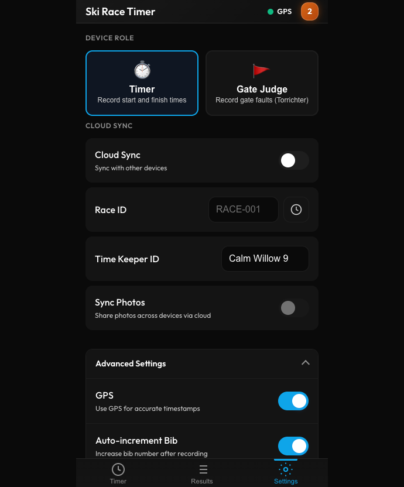

# Ski Race Timer - User Manual

**GPS-Synchronized Race Timing for Ski Events**

Version 5.11.0 | Last Updated: February 2026

---

## Table of Contents

1. [Introduction](#introduction)
2. [Getting Started](#getting-started)
3. [Timer View](#timer-view)
4. [Results View](#results-view)
5. [Settings](#settings)
6. [Gate Judge Mode](#gate-judge-mode)
7. [Multi-Device Sync](#multi-device-sync)
8. [Keyboard Shortcuts](#keyboard-shortcuts)
9. [Troubleshooting](#troubleshooting)

---

## Introduction

Ski Race Timer is a professional timing app for ski races. It works as a Progressive Web App (PWA) on any device and functions offline.

### Key Features

- **GPS-synchronized timing** for accurate timestamps across devices
- **Multi-device sync** to coordinate start and finish timers
- **Gate Judge mode** for recording gate faults
- **Two-run support** for slalom and giant slalom races
- **Offline-first** - works without internet, syncs when connected
- **Photo capture** - optional documentation for each timestamp
- **Race Horology export** - industry-standard CSV format
- **Bilingual** - English and German interfaces

---

## Getting Started

### First-Time Setup

When you first open the app, an onboarding wizard guides you through setup:

1. **Language** - Choose Deutsch or English
2. **Device Name** - Name this timer (e.g., "Start Gate", "Finish Line")
3. **Device Role** - Choose Timer or Gate Judge
4. **Photo Capture** - Enable if you want photos with each timestamp
5. **Cloud Sync** - Enter a Race ID and PIN to sync with other devices

> **Tip:** Replay the wizard anytime from Settings → Show Tutorial

### Installing as an App

For the best experience, install Ski Race Timer on your device:

**iOS (iPhone/iPad):**
1. Open in Safari
2. Tap Share → Add to Home Screen

**Android:**
1. Open in Chrome
2. Tap Menu → Install app

---

## Timer View

The Timer view is your main workspace for recording race times.


### Recording Times

1. **Enter bib number** using the number pad (displays as 3 digits: "5" → "005")
2. **Select timing point** - Start (S) or Finish (Z/F)
3. **Select run** - L1/R1 or L2/R2 for two-run races
4. **Tap "Record Time"** - captures timestamp to millisecond precision

### Number Pad

| Button | Function |
|--------|----------|
| 0-9 | Enter bib digits |
| C | Clear entire bib |
| ⌫ | Delete last digit |

### Timing Points

- **Start (S)** - When racer leaves the start gate
- **Finish (Z/F)** - When racer crosses the finish line

### Run Selection

- **L1/R1** - First run
- **L2/R2** - Second run

> **Tip:** All timers should use the same run setting during a race.

### Auto-Increment

When enabled (default), the bib number increases by 1 after recording a Finish time. Useful when racers finish in order.

### Duplicate Warning

Recording the same bib + point + run twice shows a yellow warning. The entry is still saved.

---

## Results View

View, edit, and export all recorded entries.


### Entry List

Each entry shows:
- **Bib number** (large, left)
- **Timing point** (Start/Ziel)
- **Run** (L1/L2)
- **Timestamp** (HH:MM:SS.mmm)
- **Device name** (which timer recorded it)

### Statistics

- **Total** - Number of entries
- **Racers** - Unique bib numbers
- **Finished** - Finish entries count

### Search and Filter

- **Search** - Find entries by bib number
- **Point filter** - All / Start / Finish
- **Status filter** - All / OK / DNS / DNF / DSQ

### Editing Entries

Tap an entry to edit:
- Change bib number
- Change run (L1 ↔ L2)
- Set status (OK, DNS, DNF, DSQ)

> **Note:** Timestamp and timing point cannot be edited. Delete and re-record if needed.

### Status Codes

| Code | Meaning |
|------|---------|
| OK | Normal completion |
| DNS | Did Not Start |
| DNF | Did Not Finish |
| DSQ | Disqualified |

### Actions

- **Undo** - Restore recently deleted entries
- **Export** - Download CSV for Race Horology
- **Delete All** - Clear all entries (with confirmation)

### Export Format

```csv
Startnummer;Lauf;Messpunkt;Zeit;Status;Gerät
042;1;FT;12:34:56.78;OK;Finish Timer
```

---

## Settings

Configure the app to match your needs.



### Device Role

Choose your role:
- **Timer** - Record start and finish times
- **Gate Judge** - Record gate faults

### Cloud Sync

- **Cloud Sync** toggle - Enable/disable synchronization
- **Race ID** - Unique identifier for your race (e.g., "WINTERCUP-2026")
- **Device Name** - How this device appears to others
- **Sync Photos** - Share photos across devices

### Photo Capture

When enabled, a photo is captured with each timestamp. Useful for:
- Verifying bib numbers
- Documenting finish line crossings
- Evidence for disputes

### Advanced Settings

- **GPS** - Use GPS for accurate timestamps
- **Auto-Increment** - Increase bib after Finish recording
- **Haptic Feedback** - Vibration on actions
- **Sound Feedback** - Audio beep on recording

### Language

Toggle between **DE** (Deutsch) and **EN** (English).

### Admin

- **PIN** - Set a 4-digit PIN to protect race data
- **Manage Races** - View and delete synced races

---

## Gate Judge Mode

Record gate faults during the race.


### Setup

1. Go to Settings → Select "Gate Judge" role
2. Tap "Change" to set your assigned gates (e.g., 1-10)
3. Select the current run (L1/L2)

### Recording Faults

1. **Select bib** - Tap a recent bib or type manually
2. **Select gate** - Tap the gate number where the fault occurred
3. **Select fault type**:
   - **MG** - Missed Gate
   - **STR** - Straddling
   - **BR** - Binding Release
4. **Tap "Save Fault"**

### Ready Status

Tap "Ready" to signal you're prepared for the next racer. The status appears in the header.

### Keyboard Shortcuts (Gate Judge)

| Key | Action |
|-----|--------|
| M or G | Select MG fault type |
| T | Select Threading (EF/STR) |
| B or R | Select Binding Open (BO/BR) |
| Alt+1 | Select Run 1 |
| Alt+2 | Select Run 2 |

---

## Multi-Device Sync

Coordinate multiple timing devices for professional race management.

### Typical Setup

```
         Cloud Sync
        (WINTERCUP-26)
              │
    ┌─────────┼─────────┐
    │         │         │
    ▼         ▼         ▼
  Start    Finish    Gate Judge
  Timer    Timer     (Gates 1-10)
```

### Setting Up Sync

**First device:**
1. Settings → Enable Cloud Sync
2. Enter Race ID (e.g., "CLUB-RACE-2026")
3. Set a 4-digit PIN
4. Enter a device name

**Additional devices:**
1. Enable Cloud Sync
2. Enter the **same Race ID**
3. Enter the **same PIN**
4. Give each device a unique name

### What Syncs

| Data | Syncs? |
|------|--------|
| Timing entries | Yes |
| Fault entries | Yes |
| Edits & deletions | Yes |
| Photos (if enabled) | Yes |
| Settings | No (per-device) |

### Recent Races

Tap the clock icon next to Race ID to quickly select from recently synced races.

---

## Keyboard Shortcuts

### Timer View

| Key | Action |
|-----|--------|
| 0-9 | Enter bib digits |
| Backspace | Delete last digit |
| C | Clear bib |
| Enter / Space | Record timestamp |
| S | Select Start point |
| F | Select Finish point |
| Alt+1 | Select Run 1 |
| Alt+2 | Select Run 2 |

### Results View

| Key | Action |
|-----|--------|
| ↑ / ↓ | Navigate entries |
| Enter / Space | Edit selected entry |
| E | Edit selected entry |
| Delete / D | Delete selected entry |

### Global

| Key | Action |
|-----|--------|
| Escape | Close dialogs |

---

## Troubleshooting

### Sync Issues

**Entries not appearing on other devices:**
1. Verify all devices have the same Race ID
2. Check the PIN is correct
3. Pull down on Results to refresh
4. Toggle Cloud Sync off and on

### GPS Issues

**GPS not working:**
1. Enable GPS in Settings
2. Grant location permission
3. Use outdoors with clear sky view
4. Wait 30-60 seconds for satellites

### Camera Issues

**Photo capture not working:**
1. Grant camera permission when prompted
2. Enable Photo Capture in Settings
3. Reload the app

### General Issues

**App not loading:**
1. Clear browser cache
2. Reinstall the PWA
3. Try a different browser

**Data seems lost:**
1. Check you're using the correct Race ID
2. Data may be on another device
3. If synced, recover from another device

---

## Support

**Report Issues:** https://github.com/jmeckel/ski-race-timer/issues

**Version:** Check Settings (bottom of page)

---

*Ski Race Timer - Professional timing made simple.*
