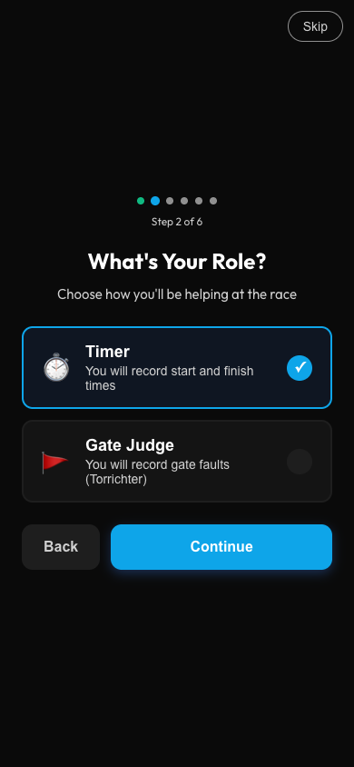

# Ski Race Timer - User Manual

**GPS-Synchronized Race Timing for Ski Events**

Version 5.26.2 | Last Updated: February 2026

---

## Table of Contents

1. [Introduction](#introduction)
2. [Getting Started](#getting-started)
3. [Timer View](#timer-view)
4. [Results View](#results-view)
5. [Gate Judge Mode](#gate-judge-mode)
6. [Chief Judge Mode](#chief-judge-mode)
7. [Settings](#settings)
8. [Multi-Device Sync](#multi-device-sync)
9. [Export Formats](#export-formats)
10. [Keyboard Shortcuts](#keyboard-shortcuts)
11. [Troubleshooting](#troubleshooting)

---

## Introduction

Ski Race Timer is a professional timing app for ski races. It works as a Progressive Web App (PWA) on any device and functions offline.

### Key Features

- **GPS-synchronized timing** for accurate timestamps across devices
- **Multi-device sync** to coordinate start and finish timers
- **Gate Judge mode** with gate-first quick entry for recording gate faults
- **Chief Judge mode** for fault review, penalty decisions, and deletion approvals
- **Two-run support** for slalom and giant slalom races
- **Voice Mode** for hands-free voice commands during timing
- **Ambient Mode** to save battery by dimming the screen during inactivity
- **Battery Power Saver** - automatic animation reduction on low battery for extended outdoor timing
- **FLT status** for U8/U10 categories (finished with fault penalty)
- **Offline-first** - works without internet, syncs when connected
- **Photo capture** - optional documentation for each timestamp
- **Race Horology export** - industry-standard CSV format
- **Trilingual** - English, German, and French interfaces

---

## Getting Started

### First-Time Setup

When you first open the app, an onboarding wizard guides you through setup:


1. **Language** - Choose Deutsch or English
2. **Device Role** - Choose Timer or Gate Judge
3. **Device Name** - Name this timer (e.g., "Start Gate", "Finish Line")
4. **Photo Capture** - Enable if you want photos with each timestamp
5. **Cloud Sync** - Enter a Race ID and PIN to sync with other devices
6. **Summary** - Review your settings before finishing



> **Tip:** Replay the wizard anytime from Settings -> Show Tutorial.

### Installing as an App

For the best experience, install Ski Race Timer on your device:

**iOS (iPhone/iPad):**
1. Open in Safari
2. Tap Share -> Add to Home Screen

**Android:**
1. Open in Chrome
2. Tap Menu -> Install app

---

## Timer View

The Timer view is your main workspace for recording race times. It features a radial dial interface inspired by the iPod click wheel, optimized for quick bib entry and one-handed operation.


### Recording Times

1. **Enter bib number** using the radial dial or number keys (displays as 3 digits: "5" -> "005")
2. **Select timing point** - Start (S) or Finish (F)
3. **Select run** - L1 or L2 for two-run races
4. **Tap "Record Time"** - captures timestamp to millisecond precision

### Radial Dial

The radial dial arranges digits 0-9 in a circle. There are two ways to enter bib numbers:

- **Tap-to-enter** - Tap any digit (0-9) on the dial ring to append it to the current bib number.
- **Spin-to-increment** - Drag your finger around the dial ring to increment or decrement the bib number continuously.

The center of the dial displays the current time and provides quick access to the timing point (S/F) and run (L1/L2) selectors.

### Spin Gesture

Dragging around the dial ring rotates the dial and increments or decrement the bib number based on direction:

- **Clockwise** - Increment bib number
- **Counter-clockwise** - Decrement bib number

After releasing, the dial continues spinning with momentum physics (friction gradually slows it). The dial snaps back to its resting position after 800ms of inactivity.

### Timing Points

- **Start (S)** - When racer leaves the start gate
- **Finish (F)** - When racer crosses the finish line

### Run Selection

- **L1** - First run
- **L2** - Second run

> **Tip:** All timers should use the same run setting during a race.

### Auto-Increment

When enabled (default), the bib number increases by 1 after recording a Finish time. Useful when racers finish in order.

### Duplicate Warning

Recording the same bib + point + run twice shows a yellow warning. The entry is still saved.

### Landscape Mode

In landscape orientation, the Timer view switches to a two-column layout:

- **Left column** - The radial dial fills the full viewport height
- **Right column** - Header, bib input, statistics, record button, and tab bar

This layout maximizes dial size while keeping all controls accessible.

### Wake Lock

While the Timer view is active, the app requests a screen wake lock to prevent the display from turning off during timing. If your browser does not support wake lock, the screen may dim according to your device settings.

### Ambient Mode

When Ambient Mode is enabled in Settings, the screen automatically dims after 30 seconds of inactivity to save battery. This is especially useful for outdoor timing sessions.

- **First tap** after dimming exits Ambient Mode (does NOT record a timestamp)
- **Second tap** records normally

This two-tap design prevents accidental timestamps when picking up or adjusting the device.

---

## Results View

View, edit, and export all recorded entries.


### Entry List

Each entry shows:
- **Bib number** (large, left)
- **Timing point** (Start/Finish)
- **Run** (L1/L2)
- **Timestamp** (HH:MM:SS.mmm)
- **Device name** (which timer recorded it)
- **Photo thumbnail** (if a photo was captured with the entry)

Entries with photos display a thumbnail icon. Tap the thumbnail to view the full photo.

### Statistics

- **Total** - Number of entries
- **Racers** - Unique bib numbers
- **Finished** - Finish entries count

### Search and Filter

- **Search** - Find entries by bib number
- **Point filter** - All / Start / Finish
- **Status filter** - All / OK / DNS / DNF / DSQ / FLT

### Pull-to-Refresh

Pull down on the results list to trigger a manual sync with the cloud. This fetches the latest entries from all connected devices.

### Editing Entries

Tap an entry to edit:
- Change bib number
- Change run (L1 <-> L2)
- Set status (OK, DNS, DNF, DSQ, FLT)

> **Note:** Timestamp and timing point cannot be edited. Delete and re-record if needed.

### Status Codes

| Code | Meaning |
|------|---------|
| OK | Normal completion |
| DNS | Did Not Start |
| DNF | Did Not Finish |
| DSQ | Disqualified |
| FLT | Finished with fault penalty (U8/U10 categories) |

### Actions

- **Undo** - Restore recently deleted entries
- **Export** - Download CSV for Race Horology (see [Export Formats](#export-formats))
- **Delete All** - Clear all entries (with confirmation)

---

## Gate Judge Mode

Record gate faults using a gate-first quick entry flow designed for one-handed phone operation.


### Setup

1. Go to Settings -> Select "Gate Judge" role
2. Tap "Change" to set your assigned gates (e.g., 1-10)
3. Select the current run (L1/L2)

### Gate-First Quick Entry

The gate judge interface is built around a gate-first workflow. Gates are the primary UI element because real ski gate judges watch specific gates and see faults happen at them.

**Recording a fault:**

1. **Tap a gate** in the 5-column grid - the gate highlights and a fault detail panel appears below
2. **Bib auto-fills** with the most recently started racer
3. **Select fault type:**
   - **MG** - Missed Gate
   - **STR** - Straddled
   - **BR** - Binding Release
4. **Tap "Save Fault"** at the bottom of the screen

**After saving:** the gate and bib remain selected for quick successive faults at the same gate. Only the fault type resets. Tapping a different gate switches to that gate. Tapping the same gate again deselects it and hides the detail panel.

### Gate Grid

Gates are displayed in a 5-column grid with large touch targets for reliable operation with gloves:

- **Red gates** - Odd-numbered gates (1, 3, 5, ...)
- **Blue gates** - Even-numbered gates (2, 4, 6, ...)
- **Fault count badges** - Gates with recorded faults display a badge showing the number of faults

### Voice Notes

After recording a fault, you can add a voice note to document additional details:

1. **After recording** - A confirmation overlay appears with an "Add Note" button
2. **Tap "Add Note"** - Opens the voice recording modal
3. **Speak your note** - The app transcribes your voice in real-time
4. **Edit if needed** - Correct any transcription errors
5. **Tap "Save"** - Note is attached to the fault (max 500 characters)

**Adding notes to existing faults:**
1. Tap a fault in the recorded faults list to edit
2. Use the microphone button next to the notes field
3. Or type manually in the text area

Faults with notes show a note indicator in the list.

> **Tip:** Voice notes use your device's speech recognition and work offline. You can always type manually if voice is not available.

### Ready Status

Tap "Ready" at the bottom of the screen to signal you are prepared for the next racer. The ready status is visible to the Chief Judge when cloud sync is active.

### Layout

The gate judge view is organized top-to-bottom for thumb reachability:

1. **Header** - Gate range display, L1/L2 run selector, "Change" button
2. **Gate Grid** - 5-column grid of gate buttons
3. **Fault Detail Panel** - Appears after selecting a gate (fault type + bib selector)
4. **Recorded Faults** - Compact scrollable list of recorded faults
5. **Footer** - "Save Fault" button + "Ready" toggle (positioned at bottom for easy thumb access)

---

## Chief Judge Mode

The Chief Judge mode provides an elevated view of all faults recorded by gate judges, with the authority to approve deletions, assign penalties, and finalize results.

### Entering Chief Judge Mode

1. Navigate to the **Results** tab
2. Tap the **Chief Judge** toggle
3. If cloud sync is enabled, enter the race PIN to verify your identity

Authentication grants the `chiefJudge` role, which is required for fault deletion and other privileged operations. The JWT token is re-issued with the elevated role.

### Fault Summary Panel

The fault summary panel displays all faults grouped by bib number:

- **Gate numbers** where faults occurred
- **Fault types** (MG, STR, BR) for each gate
- **Judge names** identifying which gate judge recorded each fault
- **Penalty calculation** based on the selected penalty mode

This consolidated view allows the chief judge to see the full fault picture for each racer at a glance.

### Fault Deletion Approval

Gate judges cannot delete faults directly. Instead, they request deletion, and the chief judge reviews:

1. Gate judge requests a fault deletion
2. The chief judge sees the pending deletion request in their panel
3. **Approve** - The fault is permanently removed
4. **Reject** - The fault remains, and the gate judge is notified

This workflow ensures that fault records are only modified with chief judge authorization.

### Penalty Mode

The chief judge can toggle between two penalty modes:

- **FLT (Fault Penalty)** - A time penalty is added per fault. The penalty duration is configurable (in seconds). Used primarily for U8/U10 categories where faults result in time additions rather than disqualification.
- **DSQ (Disqualification)** - Racers with faults are disqualified from the run.

### Finalize Racers

After confirming all faults for a bib and run, the chief judge can finalize the result. Finalized entries are locked and cannot be further modified without chief judge intervention.

### Judges Overview

The chief judge can see all connected gate judges:

- **Gate assignments** - Which gates each judge is covering
- **Ready status** - Whether each judge has signaled ready for the next racer
- **Connection status** - Active or last-seen timestamp

### Export Options

The chief judge has access to multiple export formats for documentation and results processing. See the [Export Formats](#export-formats) section for details on CSV, summary, WhatsApp, and gate judge card exports.

---

## Settings

Configure the app to match your needs.


### Device Role

Choose your role:
- **Timer** - Record start and finish times
- **Gate Judge** - Record gate faults

### Race Setup

- **Cloud Sync** toggle - Enable/disable synchronization
- **Race ID** - Unique identifier for your race (e.g., "WINTERCUP-2026")
- **Device Name** - How this device appears to others
- **Sync Photos** - Share photos across devices (photos under 500KB)

### Advanced Settings

- **GPS** - Use GPS for accurate timestamps synchronized across devices
- **Auto-Increment Bib** - Increase bib number by 1 after recording a Finish time
- **Haptic Feedback** - Vibration on button presses and recordings
- **Sound Feedback** - Audio beep when recording a timestamp
- **Ambient Mode** - Automatically dim the screen after 30 seconds of inactivity to save battery. First tap wakes the screen without recording; second tap records normally.
- **Voice Mode** - Enable hands-free voice commands for timing operations. Requires an internet connection and microphone permission.
- **Photo Capture** - Capture a photo with each timestamp for documentation

### Battery Power Saver

The app automatically detects low battery conditions using the Battery Status API and reduces power consumption:

- **Medium battery (below 30%)** - Reduced haptic feedback intensity and slightly increased sync polling intervals
- **Low battery (below 15%)** - Decorative animations (glow effects, spinners) are paused to save battery
- **Critical battery (below 5%)** - Additional frame rate reduction for the clock display
- **Charging** - Power saver deactivates when the device is plugged in, even at low battery

This is fully automatic and requires no configuration. The clock and timing functions continue to work normally in power-saver mode. If your device does not support the Battery API, the app runs with all animations enabled as usual.

### Language

Toggle between **DE** (Deutsch), **FR** (Français), and **EN** (English). All UI text, labels, and accessibility descriptions update immediately.

### Show Tutorial

Replay the onboarding wizard to reconfigure your device role, name, or sync settings.

### Admin

- **PIN** - Set a 4-digit PIN to protect race data and restrict sync access
- **Manage Races** - View all synced races with metadata, delete old races

---

## Multi-Device Sync

Coordinate multiple timing devices for professional race management.

### Typical Setup

```
         Cloud Sync
        (WINTERCUP-26)
              |
    +---------+---------+----------+
    |         |         |          |
    v         v         v          v
  Start    Finish    Gate Judge  Chief Judge
  Timer    Timer     (Gates 1-10)
```

All devices share the same Race ID and PIN. Each device syncs timing entries and fault records through the cloud in real time.

### Setting Up Sync

**First device:**
1. Settings -> Enable Cloud Sync
2. Enter Race ID (e.g., "CLUB-RACE-2026")
3. Set a 4-digit PIN
4. Enter a device name

**Additional devices:**
1. Enable Cloud Sync
2. Enter the **same Race ID**
3. Enter the **same PIN**
4. Give each device a unique name

### What Syncs

| Data | Syncs? |
|------|--------|
| Timing entries | Yes |
| Fault entries | Yes |
| Edits and deletions | Yes |
| Photos (if enabled) | Yes |
| Deletion approvals | Yes |
| Settings | No (per-device) |

### Sync Behavior

- **Polling interval** - Entries sync every 5 seconds (30 seconds on error)
- **Same-browser tabs** - Tabs in the same browser sync instantly via BroadcastChannel
- **Offline buffering** - Changes made offline are queued and sent when connectivity returns

### Recent Races

Tap the clock icon next to Race ID to quickly select from recently synced races. This saves you from re-entering long race identifiers.

---

## Export Formats

Ski Race Timer supports multiple export formats for results processing and documentation.

### CSV (Race Horology)

The primary export format uses semicolon delimiters and follows the Race Horology standard:

```
Startnummer;Lauf;Messpunkt;Zeit;Status;Geraet;Torstrafzeit;Torfehler
042;1;FT;12:34:56.78;OK;Finish Timer;;
015;1;FT;12:35:12.45;FLT;Finish Timer;4.00;2
```

| Column | Description |
|--------|-------------|
| Startnummer | Bib number |
| Lauf | Run (1 or 2) |
| Messpunkt | Timing point: ST (Start) or FT (Finish) |
| Zeit | Time in HH:MM:SS.ss (hundredths of seconds) |
| Status | OK, DNS, DNF, DSQ, or FLT |
| Geraet | Device name that recorded the entry |
| Torstrafzeit | Gate fault penalty time (seconds), if applicable |
| Torfehler | Number of gate faults, if applicable |

CSV injection protection is applied: formula characters are escaped with a single quote prefix.

### Chief Judge Summary

A text file summarizing faults per bib with penalty calculations:

- Fault count per bib and run
- Gate numbers where faults occurred
- Penalty time or DSQ status based on the selected penalty mode
- Generated from the Chief Judge panel

### WhatsApp Summary

An emoji-formatted text summary designed for quick sharing:

- Auto-copies to clipboard for pasting into WhatsApp or other messaging apps
- Compact format with racer results and fault information
- Suitable for race-day communication with coaches and teams

### Gate Judge Card

A printable text document for each gate judge:

- Header with race name, date, and gate assignment
- Fault table organized by run
- Space for judge signature
- Fault code legend (MG, STR, BR) for reference

---

## Keyboard Shortcuts

Ski Race Timer supports full keyboard and USB numpad navigation for desktop use and external keyboards.

### Timer View

| Key | Action |
|-----|--------|
| 0-9 | Enter bib digits |
| Backspace | Delete last digit |
| Escape / Delete | Clear entire bib |
| Enter / Space | Record timestamp |
| S | Select Start timing point |
| F | Select Finish timing point |
| Alt+1 | Select Run 1 |
| Alt+2 | Select Run 2 |

### Gate Judge

| Key | Action |
|-----|--------|
| M or G | Select Missed Gate (MG) |
| T | Select Straddled (STR) |
| B or R | Select Binding Release (BR) |
| 1-9, 0 | Select gate number (0 = gate 10) |
| Arrow keys | Navigate between buttons |
| Enter / Space | Confirm selection |
| Alt+1 | Select Run 1 |
| Alt+2 | Select Run 2 |

### Results View

| Key | Action |
|-----|--------|
| Arrow Up / Down | Navigate between entries |
| Enter / Space | Edit selected entry |
| E | Edit selected entry |
| Delete / D | Delete selected entry |

### Global

| Key | Action |
|-----|--------|
| Tab | Move focus to next component |
| Shift+Tab | Move focus to previous component |
| Escape | Close modal or dropdown |
| Arrow keys | Navigate within a component |

---

## Troubleshooting

### Sync Issues

**Entries not appearing on other devices:**
1. Verify all devices have the same Race ID (case-insensitive)
2. Check the PIN is correct
3. Pull down on Results to trigger a manual refresh
4. Toggle Cloud Sync off and on in Settings
5. Check your internet connection

### GPS Issues

**GPS not working:**
1. Enable GPS in Settings
2. Grant location permission when prompted
3. Use outdoors with clear sky view
4. Wait 30-60 seconds for satellite acquisition

### Camera Issues

**Photo capture not working:**
1. Grant camera permission when prompted
2. Enable Photo Capture in Settings
3. Reload the app if the permission dialog does not appear

### Wake Lock Issues

**Screen dims during timing:**
- Enable **Ambient Mode** in Settings to control when dimming happens (dims after 30s of inactivity, wakes on first tap)
- Some browsers do not support the Wake Lock API. In this case, adjust your device's screen timeout setting to a longer duration.
- A toast notification appears if wake lock fails to activate

### Voice Mode Issues

**Voice commands not working:**
1. Voice Mode requires an active internet connection
2. Grant microphone permission when prompted by the browser
3. Speak clearly and at a moderate pace
4. Check that Voice Mode is enabled in Settings -> Advanced Settings
5. If speech recognition is unavailable on your device, use manual input instead

### Ambient Mode Issues

**Screen does not respond after dimming:**
- This is by design: the first tap after dimming only wakes the screen and does NOT record a timestamp
- Tap a second time to perform the intended action
- This prevents accidental recordings when handling the device

### General Issues

**App not loading:**
1. Clear browser cache
2. Reinstall the PWA
3. Try a different browser

**Data seems lost:**
1. Check you are using the correct Race ID
2. Data may be on another device - check sync status
3. If synced, recover from another connected device

---

## Support

**Report Issues:** https://github.com/jmeckel/ski-race-timer/issues

**Version:** 5.26.2

---

*Ski Race Timer - Professional timing made simple.*
