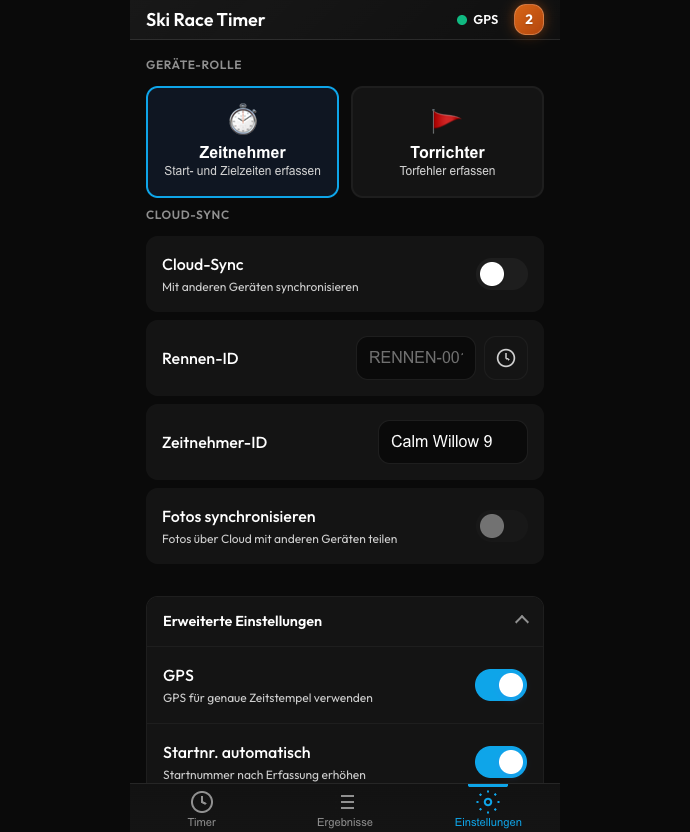

# Ski Race Timer - Benutzerhandbuch

**GPS-synchronisierte Zeitmessung für Skirennen**

Version 5.11.0 | Stand: Februar 2026

---

## Inhaltsverzeichnis

1. [Einführung](#einführung)
2. [Erste Schritte](#erste-schritte)
3. [Timer-Ansicht](#timer-ansicht)
4. [Ergebnis-Ansicht](#ergebnis-ansicht)
5. [Einstellungen](#einstellungen)
6. [Torrichter-Modus](#torrichter-modus)
7. [Mehrgeräte-Synchronisation](#mehrgeräte-synchronisation)
8. [Tastaturkürzel](#tastaturkürzel)
9. [Fehlerbehebung](#fehlerbehebung)

---

## Einführung

Ski Race Timer ist eine professionelle Zeitmessungs-App für Skirennen. Sie funktioniert als Progressive Web App (PWA) auf jedem Gerät und auch offline.

### Hauptfunktionen

- **GPS-synchronisierte Zeitmessung** für präzise Zeitstempel über alle Geräte
- **Mehrgeräte-Synchronisation** zur Koordination von Start- und Zielzeitmessung
- **Torrichter-Modus** zur Erfassung von Torfehlern
- **Zwei-Lauf-Unterstützung** für Slalom und Riesenslalom
- **Offline-First** - funktioniert ohne Internet, synchronisiert bei Verbindung
- **Fotoaufnahme** - optionale Dokumentation für jeden Zeitstempel
- **Race Horology Export** - branchenübliches CSV-Format
- **Zweisprachig** - Deutsche und englische Oberfläche

---

## Erste Schritte

### Ersteinrichtung

Beim ersten Öffnen der App führt Sie ein Einrichtungsassistent durch die Konfiguration:

1. **Sprache** - Wählen Sie Deutsch oder English
2. **Gerätename** - Benennen Sie diesen Timer (z.B. "Starttor", "Ziellinie")
3. **Geräte-Rolle** - Wählen Sie Zeitnehmer oder Torrichter
4. **Fotoaufnahme** - Aktivieren, wenn Sie Fotos zu jedem Zeitstempel möchten
5. **Cloud-Sync** - Geben Sie eine Rennen-ID und PIN ein, um mit anderen Geräten zu synchronisieren

> **Tipp:** Starten Sie den Assistenten jederzeit neu über Einstellungen → Tutorial anzeigen

### Als App installieren

Für die beste Nutzung installieren Sie Ski Race Timer auf Ihrem Gerät:

**iOS (iPhone/iPad):**
1. In Safari öffnen
2. Teilen → Zum Home-Bildschirm

**Android:**
1. In Chrome öffnen
2. Menü → App installieren

---

## Timer-Ansicht

Die Timer-Ansicht ist Ihr Hauptarbeitsbereich für die Erfassung von Rennzeiten.


### Zeiten erfassen

1. **Startnummer eingeben** mit dem Nummernblock (wird 3-stellig angezeigt: "5" → "005")
2. **Messpunkt auswählen** - Start (S) oder Ziel (Z)
3. **Lauf auswählen** - L1 oder L2 für Zwei-Lauf-Rennen
4. **Auf "Zeit erfassen" tippen** - erfasst den Zeitstempel auf Millisekunden genau

### Nummernblock

| Taste | Funktion |
|-------|----------|
| 0-9 | Startnummer-Ziffern eingeben |
| C | Gesamte Startnummer löschen |
| ⌫ | Letzte Ziffer löschen |

### Messpunkte

- **Start (S)** - Wenn der Läufer das Starttor verlässt
- **Ziel (Z)** - Wenn der Läufer die Ziellinie überquert

### Laufauswahl

- **L1** - Erster Durchgang
- **L2** - Zweiter Durchgang

> **Tipp:** Alle Timer sollten während eines Rennens die gleiche Lauf-Einstellung verwenden.

### Auto-Inkrement

Wenn aktiviert (Standard), erhöht sich die Startnummer nach Erfassung einer Ziel-Zeit automatisch um 1. Nützlich, wenn Läufer der Reihe nach ins Ziel kommen.

### Duplikat-Warnung

Die gleiche Kombination aus Startnummer + Messpunkt + Lauf zweimal zu erfassen, zeigt eine gelbe Warnung. Der Eintrag wird trotzdem gespeichert.

---

## Ergebnis-Ansicht

Alle erfassten Einträge anzeigen, bearbeiten und exportieren.


### Eintragsliste

Jeder Eintrag zeigt:
- **Startnummer** (groß, links)
- **Messpunkt** (Start/Ziel)
- **Lauf** (L1/L2)
- **Zeitstempel** (HH:MM:SS.mmm)
- **Gerätename** (welcher Timer hat erfasst)

### Statistik

- **Gesamt** - Anzahl der Einträge
- **Läufer** - Einzigartige Startnummern
- **Im Ziel** - Anzahl der Ziel-Einträge

### Suchen und Filtern

- **Suche** - Einträge nach Startnummer finden
- **Messpunkt-Filter** - Alle / Start / Ziel
- **Status-Filter** - Alle / OK / DNS / DNF / DSQ

### Einträge bearbeiten

Auf einen Eintrag tippen zum Bearbeiten:
- Startnummer ändern
- Lauf ändern (L1 ↔ L2)
- Status setzen (OK, DNS, DNF, DSQ)

> **Hinweis:** Zeitstempel und Messpunkt können nicht bearbeitet werden. Bei Bedarf löschen und neu erfassen.

### Statuscodes

| Code | Bedeutung |
|------|-----------|
| OK | Normaler Abschluss |
| DNS | Did Not Start (nicht gestartet) |
| DNF | Did Not Finish (nicht beendet) |
| DSQ | Disqualifiziert |

### Aktionen

- **Rückgängig** - Kürzlich gelöschte Einträge wiederherstellen
- **Exportieren** - CSV für Race Horology herunterladen
- **Alle löschen** - Alle Einträge löschen (mit Bestätigung)

### Export-Format

```csv
Startnummer;Lauf;Messpunkt;Zeit;Status;Gerät
042;1;FT;12:34:56.78;OK;Ziel Timer
```

---

## Einstellungen

Konfigurieren Sie die App nach Ihren Bedürfnissen.



### Geräte-Rolle

Wählen Sie Ihre Rolle:
- **Zeitnehmer** - Start- und Zielzeiten erfassen
- **Torrichter** - Torfehler erfassen

### Cloud-Sync

- **Cloud-Sync** Schalter - Synchronisation aktivieren/deaktivieren
- **Rennen-ID** - Eindeutige Kennung für Ihr Rennen (z.B. "WINTERCUP-2026")
- **Gerätename** - Wie dieses Gerät anderen angezeigt wird
- **Fotos synchronisieren** - Fotos über Geräte teilen

### Fotoaufnahme

Wenn aktiviert, wird bei jedem Zeitstempel ein Foto aufgenommen. Nützlich für:
- Startnummern verifizieren
- Zieleinläufe dokumentieren
- Beweismaterial bei Streitfällen

### Erweiterte Einstellungen

- **GPS** - GPS für genaue Zeitstempel verwenden
- **Auto-Inkrement** - Startnummer nach Ziel-Erfassung erhöhen
- **Haptisches Feedback** - Vibration bei Aktionen
- **Ton-Feedback** - Akustisches Signal bei Erfassung

### Sprache

Umschalten zwischen **DE** (Deutsch) und **EN** (English).

### Admin

- **PIN** - 4-stellige PIN zum Schutz der Renndaten setzen
- **Rennen verwalten** - Synchronisierte Rennen anzeigen und löschen

---

## Torrichter-Modus

Torfehler während des Rennens erfassen.


### Einrichtung

1. Zu Einstellungen → Rolle "Torrichter" wählen
2. Auf "Ändern" tippen, um zugewiesene Tore einzustellen (z.B. 1-10)
3. Aktuellen Lauf auswählen (L1/L2)

### Fehler erfassen

1. **Startnummer wählen** - Eine kürzliche Startnummer tippen oder manuell eingeben
2. **Tor wählen** - Die Tornummer tippen, bei der der Fehler aufgetreten ist
3. **Fehlerart wählen**:
   - **TF** - Tor ausgelassen
   - **EF** - Einfädler
   - **BO** - Bindung offen
4. **"Fehler speichern" tippen**

### Bereit-Status

Auf "Bereit" tippen, um zu signalisieren, dass Sie für den nächsten Läufer bereit sind. Der Status erscheint in der Kopfzeile.

### Tastaturkürzel (Torrichter)

| Taste | Aktion |
|-------|--------|
| M oder G | Fehlerart MG wählen |
| T | Fehlerart Einfädler (EF/STR) wählen |
| B oder R | Fehlerart Bindung (BO/BR) wählen |
| Alt+1 | Lauf 1 wählen |
| Alt+2 | Lauf 2 wählen |

---

## Mehrgeräte-Synchronisation

Koordinieren Sie mehrere Zeitmessungsgeräte für professionelles Rennmanagement.

### Typischer Aufbau

```
         Cloud Sync
        (WINTERCUP-26)
              │
    ┌─────────┼─────────┐
    │         │         │
    ▼         ▼         ▼
  Start     Ziel    Torrichter
  Timer     Timer   (Tore 1-10)
```

### Synchronisation einrichten

**Erstes Gerät:**
1. Einstellungen → Cloud-Sync aktivieren
2. Rennen-ID eingeben (z.B. "VEREINS-RENNEN-2026")
3. 4-stellige PIN festlegen
4. Gerätenamen eingeben

**Weitere Geräte:**
1. Cloud-Sync aktivieren
2. **Gleiche Rennen-ID** eingeben
3. **Gleiche PIN** eingeben
4. Jedem Gerät einen eindeutigen Namen geben

### Was wird synchronisiert

| Daten | Synchronisiert? |
|-------|-----------------|
| Zeiteinträge | Ja |
| Fehlereinträge | Ja |
| Bearbeitungen & Löschungen | Ja |
| Fotos (wenn aktiviert) | Ja |
| Einstellungen | Nein (pro Gerät) |

### Kürzliche Rennen

Auf das Uhr-Symbol neben der Rennen-ID tippen, um schnell aus kürzlich synchronisierten Rennen auszuwählen.

---

## Tastaturkürzel

### Timer-Ansicht

| Taste | Aktion |
|-------|--------|
| 0-9 | Startnummer-Ziffern eingeben |
| Rücktaste | Letzte Ziffer löschen |
| C | Startnummer löschen |
| Enter / Leertaste | Zeitstempel erfassen |
| S | Start-Messpunkt wählen |
| F | Ziel-Messpunkt wählen |
| Alt+1 | Lauf 1 wählen |
| Alt+2 | Lauf 2 wählen |

### Ergebnis-Ansicht

| Taste | Aktion |
|-------|--------|
| ↑ / ↓ | Einträge navigieren |
| Enter / Leertaste | Ausgewählten Eintrag bearbeiten |
| E | Ausgewählten Eintrag bearbeiten |
| Entf / D | Ausgewählten Eintrag löschen |

### Global

| Taste | Aktion |
|-------|--------|
| Escape | Dialoge schließen |

---

## Fehlerbehebung

### Synchronisationsprobleme

**Einträge erscheinen nicht auf anderen Geräten:**
1. Überprüfen Sie, ob alle Geräte die gleiche Rennen-ID haben
2. Prüfen Sie, ob die PIN korrekt ist
3. In der Ergebnis-Ansicht nach unten ziehen zum Aktualisieren
4. Cloud-Sync aus- und wieder einschalten

### GPS-Probleme

**GPS funktioniert nicht:**
1. GPS in den Einstellungen aktivieren
2. Standort-Berechtigung erteilen
3. Im Freien mit freier Sicht zum Himmel verwenden
4. 30-60 Sekunden auf Satellitenerfassung warten

### Kamera-Probleme

**Fotoaufnahme funktioniert nicht:**
1. Bei Aufforderung Kamera-Berechtigung erteilen
2. Fotoaufnahme in den Einstellungen aktivieren
3. Die App neu laden

### Allgemeine Probleme

**App lädt nicht:**
1. Browser-Cache leeren
2. PWA neu installieren
3. Anderen Browser ausprobieren

**Daten scheinen verloren:**
1. Prüfen Sie, ob Sie die richtige Rennen-ID verwenden
2. Daten könnten auf einem anderen Gerät sein
3. Wenn synchronisiert, von einem anderen Gerät wiederherstellen

---

## Support

**Probleme melden:** https://github.com/jmeckel/ski-race-timer/issues

**Version:** In Einstellungen prüfen (unten auf der Seite)

---

*Ski Race Timer - Professionelle Zeitmessung leicht gemacht.*
