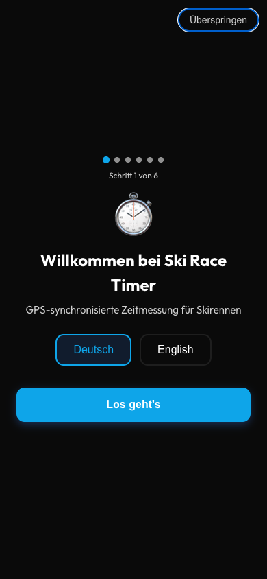
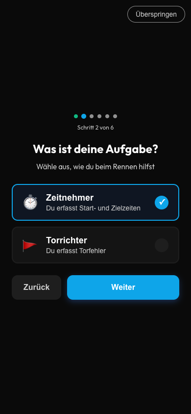
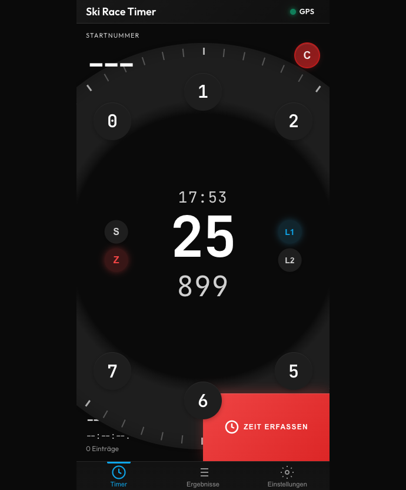
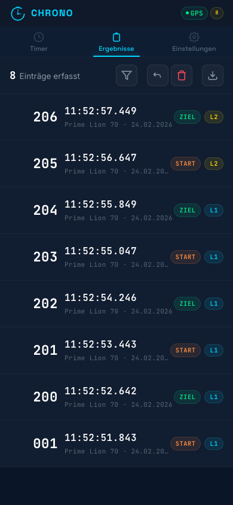
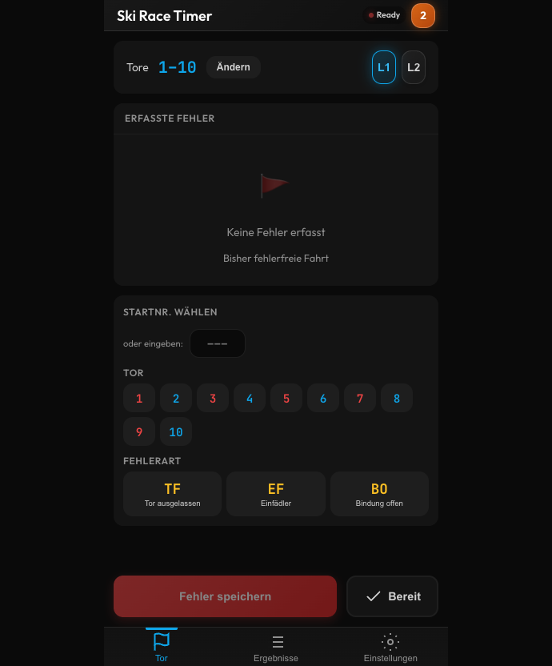
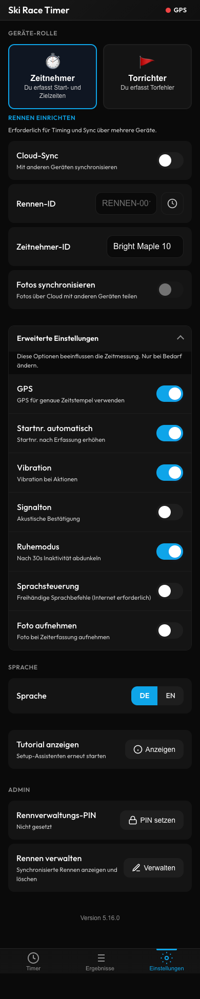

# Ski Race Timer - Benutzerhandbuch

**GPS-synchronisierte Zeitmessung für Skirennen**

Version 5.24.7 | Stand: Februar 2026

---

## Inhaltsverzeichnis

1. [Einführung](#einführung)
2. [Erste Schritte](#erste-schritte)
3. [Timer-Ansicht](#timer-ansicht)
4. [Ergebnis-Ansicht](#ergebnis-ansicht)
5. [Torrichter-Modus](#torrichter-modus)
6. [Obmann-Modus](#obmann-modus)
7. [Einstellungen](#einstellungen)
8. [Mehrgeräte-Synchronisation](#mehrgeräte-synchronisation)
9. [Export-Formate](#export-formate)
10. [Tastaturkürzel](#tastaturkürzel)
11. [Fehlerbehebung](#fehlerbehebung)

---

## Einführung

Ski Race Timer ist eine professionelle Zeitmessungs-App für Skirennen. Sie funktioniert als Progressive Web App (PWA) auf jedem Gerät und auch offline.

### Hauptfunktionen

- **GPS-synchronisierte Zeitmessung** für präzise Zeitstempel über alle Geräte
- **Mehrgeräte-Synchronisation** zur Koordination von Start- und Zielzeitmessung
- **Torrichter-Modus** zur Erfassung von Torfehlern mit Tor-zuerst-Eingabe
- **Obmann-Modus** zur Fehlerübersicht, Strafberechnung und Löschgenehmigung
- **Sprachsteuerung** für freihändige Bedienung am Hang
- **Ruhemodus** zum Schutz vor versehentlichen Zeitstempeln bei Inaktivität
- **Batterieschoner** - automatische Reduzierung von Animationen bei niedrigem Akkustand für längere Akkulaufzeit
- **STR-Status** (Strafzeit) für U8/U10-Kategorien
- **Zwei-Lauf-Unterstützung** für Slalom und Riesenslalom
- **Offline-First** - funktioniert ohne Internet, synchronisiert bei Verbindung
- **Fotoaufnahme** - optionale Dokumentation für jeden Zeitstempel
- **Race Horology Export** - branchenübliches CSV-Format
- **Zweisprachig** - Deutsche und englische Oberfläche

---

## Erste Schritte

### Ersteinrichtung

Beim ersten Öffnen der App führt Sie ein Einrichtungsassistent durch die Konfiguration in 6 Schritten:



1. **Sprache** - Wählen Sie Deutsch oder English
2. **Rolle** - Wählen Sie Ihre Geräte-Rolle (Zeitnehmer oder Torrichter)
3. **Gerätename** - Benennen Sie diesen Timer (z.B. "Starttor", "Ziellinie")
4. **Fotoaufnahme** - Aktivieren, wenn Sie Fotos zu jedem Zeitstempel möchten
5. **Cloud-Sync** - Geben Sie eine Rennen-ID und PIN ein, um mit anderen Geräten zu synchronisieren
6. **Zusammenfassung** - Übersicht Ihrer gewählten Einstellungen zur Bestätigung



> **Tipp:** Starten Sie den Assistenten jederzeit neu über Einstellungen -> Tutorial anzeigen

### Überspringen

Der Assistent kann jederzeit mit dem "Überspringen"-Button abgebrochen werden. Bereits eingegebene Daten (Gerätename, Rolle) werden dabei gespeichert.

### Als App installieren

Für die beste Nutzung installieren Sie Ski Race Timer auf Ihrem Gerät:

**iOS (iPhone/iPad):**
1. In Safari öffnen
2. Teilen -> Zum Home-Bildschirm

**Android:**
1. In Chrome öffnen
2. Menü -> App installieren

---

## Timer-Ansicht

Die Timer-Ansicht ist Ihr Hauptarbeitsbereich für die Erfassung von Rennzeiten. Sie verwendet ein radiales Zifferblatt im iPod-Stil.



### Zeiten erfassen

1. **Startnummer eingeben** - Zahlen (0-9) auf dem Zifferblatt antippen (wird 3-stellig angezeigt: "5" -> "005")
2. **Messpunkt auswählen** - S (Start) oder Z (Ziel) in der Mitte des Zifferblatts
3. **Lauf auswählen** - L1 oder L2 in der Mitte des Zifferblatts
4. **Auf "Zeit erfassen" tippen** - erfasst den Zeitstempel auf Millisekunden genau

### Radiales Zifferblatt

Das Zifferblatt bietet mehrere Eingabemethoden:

- **Antippen**: Zahl (0-9) auf dem Ring antippen, um eine Ziffer zur Startnummer hinzuzufügen
- **C (Löschen)**: Gesamte Startnummer löschen
- **Rücktaste**: Letzte Ziffer löschen

### Drehgeste

Zusätzlich zur Tipp-Eingabe können Sie die Startnummer durch Drehen am Ring ändern:

- **Im Uhrzeigersinn drehen** - Startnummer erhöhen
- **Gegen den Uhrzeigersinn drehen** - Startnummer verringern
- **Schwungphysik** - Das Zifferblatt dreht sich nach dem Loslassen mit Trägheit weiter
- **Rückschnappen** - Nach 800 ms Inaktivität kehrt das Zifferblatt in die Ausgangsposition zurück

### Messpunkte

- **Start (S)** - Wenn der Läufer das Starttor verlässt
- **Ziel (Z)** - Wenn der Läufer die Ziellinie überquert

### Laufauswahl

- **L1** - Erster Durchgang
- **L2** - Zweiter Durchgang

> **Tipp:** Alle Timer sollten während eines Rennens die gleiche Lauf-Einstellung verwenden.

### Auto-Inkrement

Wenn aktiviert (Standard), erhöht sich die Startnummer nach Erfassung einer Ziel-Zeit automatisch um 1. Nützlich, wenn Läufer der Reihe nach ins Ziel kommen.

### Duplikat-Warnung

Die gleiche Kombination aus Startnummer + Messpunkt + Lauf zweimal zu erfassen, zeigt eine gelbe Warnung. Der Eintrag wird trotzdem gespeichert.

### Querformat

Im Querformat wechselt die Ansicht automatisch zu einem Zwei-Spalten-Layout:
- **Linke Spalte** - Zifferblatt (volle Bildschirmhöhe)
- **Rechte Spalte** - Kopfzeile, Startnummer-Eingabe, Statistik, Erfassungs-Button, Tab-Leiste

### Bildschirmsperre

Während der Zeitmessung bleibt der Bildschirm aktiv (Wake Lock). So wird verhindert, dass der Bildschirm während eines Laufs abschaltet.

> **Hinweis:** Falls die Bildschirmsperre nicht aktiviert werden kann, zeigt die App eine Warnung an.

### Ruhemodus

Um versehentliche Zeitstempel bei Inaktivität zu vermeiden, aktiviert die App nach 30 Sekunden ohne Bedienung einen Ruhemodus:

- **Bildschirm dimmt** nach 30 Sekunden Inaktivität
- **Erstes Tippen** beendet den Ruhemodus (erfasst **keinen** Zeitstempel)
- **Zweites Tippen** erfasst den Zeitstempel wie gewohnt

Dieses Verhalten ist beabsichtigt und schützt vor ungewollten Erfassungen, z.B. in der Jackentasche.

> **Tipp:** Der Ruhemodus kann in den Einstellungen unter "Erweitert" aktiviert oder deaktiviert werden.

---

## Ergebnis-Ansicht

Alle erfassten Einträge anzeigen, bearbeiten und exportieren.



### Eintragsliste

Jeder Eintrag zeigt:
- **Startnummer** (gross, links)
- **Messpunkt** (Start/Ziel)
- **Lauf** (L1/L2)
- **Zeitstempel** (HH:MM:SS.mmm)
- **Gerätename** (welcher Timer hat erfasst)
- **Foto-Vorschau** (Vorschaubild, wenn ein Foto zum Eintrag existiert)

### Statistik

- **Gesamt** - Anzahl der Einträge
- **Läufer** - Einzigartige Startnummern
- **Im Ziel** - Anzahl der Ziel-Einträge

### Suchen und Filtern

- **Suche** - Einträge nach Startnummer finden
- **Messpunkt-Filter** - Alle / Start / Ziel
- **Status-Filter** - Alle / OK / DNS / DNF / DSQ / STR

### Einträge bearbeiten

Auf einen Eintrag tippen zum Bearbeiten:
- Startnummer ändern
- Lauf ändern (L1 <-> L2)
- Status setzen (OK, DNS, DNF, DSQ, STR)

> **Hinweis:** Zeitstempel und Messpunkt können nicht bearbeitet werden. Bei Bedarf löschen und neu erfassen.

### Statuscodes

| Code | Bedeutung |
|------|-----------|
| OK | Normaler Abschluss |
| DNS | Did Not Start (nicht gestartet) |
| DNF | Did Not Finish (nicht beendet) |
| DSQ | Disqualifiziert |
| STR | Mit Strafzeit beendet (U8/U10-Kategorien) |

### Pull-to-Refresh

In der Ergebnis-Ansicht nach unten ziehen, um synchronisierte Einträge manuell zu aktualisieren.

### Aktionen

- **Rückgängig** - Kürzlich gelöschte Einträge wiederherstellen
- **Exportieren** - CSV für Race Horology herunterladen
- **Alle löschen** - Alle Einträge löschen (mit Bestätigung)

---

## Torrichter-Modus

Der Torrichter-Modus verwendet ein **Tor-zuerst-Eingabeverfahren**: Zuerst wird das Tor ausgewählt, dann die Fehlerart. Dieser Ablauf entspricht der tatsächlichen Arbeitsweise am Hang, da Torrichter bestimmte Tore beobachten und Fehler dort auftreten sehen.



### Einrichtung

1. Zu Einstellungen -> Rolle "Torrichter" wählen
2. Auf "Ändern" tippen, um zugewiesene Tore einzustellen (z.B. 1-10)
3. Aktuellen Lauf auswählen (L1/L2)

### Bildschirm-Layout (von oben nach unten)

1. **Kopfzeile** - Torbereich-Anzeige, L1/L2-Laufauswahl, "Ändern"-Button
2. **Torraster** - 5-Spalten-Raster mit grossen, farbcodierten Tor-Buttons
3. **Fehlerdetail-Panel** - Erscheint unterhalb der Tore nach Tor-Auswahl
4. **Erfasste Fehler** - Kompakte, scrollbare Liste der gespeicherten Fehler
5. **Fusszeile** - "Fehler speichern"-Button und "Bereit"-Schalter (daumenfreundlich am unteren Rand)

### Fehler erfassen (Tor-zuerst-Ablauf)

1. **Tor antippen** im 5-Spalten-Raster
2. **Fehlerdetail-Panel** erscheint unterhalb des Rasters
3. **Startnummer** wird automatisch mit dem zuletzt gestarteten Läufer befüllt
4. **Fehlerart wählen**:
   - **TF** - Tor ausgelassen (Tourfehler)
   - **EF** - Einfädler
   - **BO** - Bindung offen
5. **"Fehler speichern" tippen**

**Nach dem Speichern:** Tor und Startnummer bleiben ausgewählt, nur die Fehlerart wird zurückgesetzt. So können Sie schnell mehrere Fehler am gleichen Tor für den gleichen Läufer erfassen.

**Tor abwählen:** Dasselbe Tor nochmals antippen blendet das Fehlerdetail-Panel wieder aus.

### Torraster

- **5 Spalten** mit grossen Touch-Flächen (56px Höhe)
- **Farbcodierung**: Rote Buttons für ungerade Tore, blaue Buttons für gerade Tore
- **Fehlerzähler-Badges**: Tore mit bereits erfassten Fehlern zeigen die Anzahl als Badge an

### Sprachnotizen

Nach der Erfassung eines Fehlers können Sie eine Sprachnotiz hinzufügen, um Details zu dokumentieren:

1. **Nach der Erfassung** - Eine Bestätigungs-Anzeige erscheint mit "Notiz hinzufügen"-Button
2. **"Notiz hinzufügen" tippen** - Öffnet das Sprachaufnahme-Fenster
3. **Ihre Notiz sprechen** - Die App transkribiert Ihre Stimme in Echtzeit
4. **Bei Bedarf korrigieren** - Transkriptionsfehler korrigieren
5. **"Speichern" tippen** - Notiz wird dem Fehler angehängt (max. 500 Zeichen)

**Notizen zu bestehenden Fehlern hinzufügen:**
1. Auf einen Fehler in der Liste tippen zum Bearbeiten
2. Das Mikrofon-Symbol neben dem Notiz-Feld verwenden
3. Oder manuell in das Textfeld eingeben

**Notiz-Anzeige:** Fehler mit Notizen zeigen ein Notiz-Symbol in der Liste.

> **Tipp:** Sprachnotizen funktionieren offline mit der Spracherkennung Ihres Geräts. Sie können jederzeit manuell tippen, wenn Spracheingabe nicht verfügbar ist.

### Bereit-Status

Am unteren Bildschirmrand befindet sich der "Bereit"-Schalter. Tippen Sie darauf, um zu signalisieren, dass Sie für den nächsten Läufer bereit sind. Der Status wird im Obmann-Modus angezeigt.

> **Hinweis:** Der "Bereit"-Schalter und der "Fehler speichern"-Button sind bewusst am unteren Rand positioniert, damit sie bequem mit dem Daumen erreichbar sind - wichtig für Torrichter, die möglicherweise Ausrüstung halten oder Handschuhe tragen.

### Tastaturkürzel (Torrichter)

| Taste | Aktion |
|-------|--------|
| M oder G | Fehlerart TF (Tor ausgelassen) wählen |
| T | Fehlerart EF (Einfädler) wählen |
| B oder R | Fehlerart BO (Bindung offen) wählen |
| 1-9, 0 | Tornummer wählen (0 = Tor 10) |
| Pfeiltasten | Zwischen Buttons navigieren |
| Leertaste / Enter | Auswahl bestätigen |
| Alt+1 | Lauf 1 wählen |
| Alt+2 | Lauf 2 wählen |

---

## Obmann-Modus

Der Obmann-Modus bietet eine zentrale Übersicht über alle Torfehler, ermöglicht Strafberechnungen und steuert die Löschgenehmigung von Fehlereinträgen.

### Zugang

1. Zum **Ergebnis-Tab** wechseln
2. Den **Obmann-Schalter** aktivieren
3. Bei aktivem Cloud-Sync wird eine **PIN-Verifizierung** verlangt (Obmann-Rolle erfordert erhöhte Berechtigungen)

> **Hinweis:** Der Obmann-Modus erfordert die Rolle "Obmann" (chiefJudge). Die App authentifiziert sich beim Aktivieren automatisch mit dieser Rolle.

### Fehlerübersicht

Die Fehlerübersicht zeigt alle erfassten Torfehler, gruppiert nach Startnummer:

- **Startnummer** und Lauf
- **Tore** mit Fehlern
- **Fehlerarten** (TF, EF, BO) pro Tor
- **Richternamen** (welcher Torrichter den Fehler erfasst hat)
- **Strafberechnung** basierend auf dem gewählten Strafmodus

### Fehlerlöschung genehmigen

Torrichter können Fehler nicht selbständig löschen. Stattdessen:

1. **Torrichter** beantragt die Löschung eines Fehlers
2. **Obmann** sieht ausstehende Löschanträge in seiner Übersicht
3. **Obmann** kann jeden Antrag einzeln **genehmigen** oder **ablehnen**

Dieses Verfahren stellt sicher, dass keine Fehlerdaten versehentlich oder unberechtigt entfernt werden.

### Strafmodus

Der Obmann kann zwischen zwei Strafmodi umschalten:

- **STR (Strafzeit)** - Pro Fehler wird eine einstellbare Anzahl Strafsekunden berechnet. Geeignet für U8/U10-Kategorien, bei denen Fehler zu Zeitstrafen statt Disqualifikation führen.
- **DSQ (Disqualifikation)** - Fehler führen zur Disqualifikation des Läufers.

Die Strafzeit pro Fehler ist konfigurierbar (z.B. 3 Sekunden, 5 Sekunden).

### Läufer finalisieren

Nach Bestätigung aller Fehler für eine Startnummer und einen Lauf kann der Obmann die Ergebnisse finalisieren (sperren). Finalisierte Einträge können nicht mehr bearbeitet werden.

### Richterübersicht

Der Obmann sieht eine Übersicht aller verbundenen Torrichter:

- **Name** des Torrichters
- **Zugewiesener Torbereich** (z.B. Tore 1-10)
- **Bereit-Status** (ob der Torrichter für den nächsten Läufer bereit ist)

### Export

Der Obmann hat Zugang zu erweiterten Export-Funktionen (siehe [Export-Formate](#export-formate)):
- CSV-Export (Race Horology)
- Obmann-Zusammenfassung
- WhatsApp-Zusammenfassung
- Torrichterkarte

---

## Einstellungen

Konfigurieren Sie die App nach Ihren Bedürfnissen.



### Geräte-Rolle

Wählen Sie Ihre Rolle:
- **Zeitnehmer** - Start- und Zielzeiten erfassen
- **Torrichter** - Torfehler erfassen

### Rennen einrichten

- **Cloud-Sync** Schalter - Synchronisation aktivieren/deaktivieren
- **Rennen-ID** - Eindeutige Kennung für Ihr Rennen (z.B. "WINTERCUP-2026")
- **Gerätename** - Wie dieses Gerät anderen angezeigt wird
- **Fotos synchronisieren** - Fotos über Geräte teilen (nur Fotos unter 500 KB)

### Erweiterte Einstellungen

| Einstellung | Beschreibung |
|-------------|--------------|
| GPS | GPS für genaue Zeitstempel verwenden |
| Startnr. automatisch | Startnummer nach Ziel-Erfassung automatisch erhöhen |
| Vibration | Haptisches Feedback bei Aktionen |
| Signalton | Akustisches Signal bei Erfassung |
| Ruhemodus | Nach 30 Sekunden Inaktivität Bildschirm abdunkeln (schützt vor versehentlichen Zeitstempeln) |
| Sprachsteuerung | Freihändige Sprachbefehle für die Bedienung am Hang (Internetverbindung erforderlich) |
| Foto aufnehmen | Bei jedem Zeitstempel automatisch ein Foto aufnehmen |

### Batterieschoner

Die App erkennt automatisch niedrige Akkustände über die Battery Status API und reduziert den Stromverbrauch:

- **Mittlerer Akku (unter 30%)** - Reduzierte Vibrationsintensität und leicht verlängerte Sync-Intervalle
- **Niedriger Akku (unter 15%)** - Dekorative Animationen (Leuchteffekte, Spinner) werden pausiert
- **Kritischer Akku (unter 5%)** - Zusätzliche Reduzierung der Bildwiederholrate der Uhranzeige
- **Beim Laden** - Der Batterieschoner deaktiviert sich, wenn das Gerät angeschlossen ist, auch bei niedrigem Akku

Dies geschieht vollautomatisch und erfordert keine Konfiguration. Uhr und Zeiterfassung funktionieren im Energiesparmodus normal weiter. Falls Ihr Gerät die Battery API nicht unterstützt, läuft die App mit allen Animationen wie gewohnt.

### Fotoaufnahme

Wenn aktiviert, wird bei jedem Zeitstempel ein Foto aufgenommen. Nützlich für:
- Startnummern verifizieren
- Zieleinläufe dokumentieren
- Beweismaterial bei Streitfällen

### Sprache

Umschalten zwischen **DE** (Deutsch) und **EN** (English).

### Tutorial anzeigen

Startet den Einrichtungsassistenten erneut, um Einstellungen zu überprüfen oder zu ändern.

### Admin

- **PIN** - 4-stellige PIN zum Schutz der Renndaten setzen
- **Rennen verwalten** - Synchronisierte Rennen anzeigen und löschen

---

## Mehrgeräte-Synchronisation

Koordinieren Sie mehrere Zeitmessungsgeräte für professionelles Rennmanagement.

### Typischer Aufbau

```
         Cloud Sync
        (WINTERCUP-26)
              |
    +---------+---------+----------+
    |         |         |          |
    v         v         v          v
  Start     Ziel    Torrichter   Obmann
  Timer     Timer   (Tore 1-10)
```

### Synchronisation einrichten

**Erstes Gerät:**
1. Einstellungen -> Cloud-Sync aktivieren
2. Rennen-ID eingeben (z.B. "VEREINS-RENNEN-2026")
3. 4-stellige PIN festlegen
4. Gerätenamen eingeben

**Weitere Geräte:**
1. Cloud-Sync aktivieren
2. **Gleiche Rennen-ID** eingeben
3. **Gleiche PIN** eingeben
4. Jedem Gerät einen eindeutigen Namen geben

### Was wird synchronisiert

| Daten | Synchronisiert? |
|-------|-----------------|
| Zeiteinträge | Ja |
| Fehlereinträge | Ja |
| Bearbeitungen und Löschungen | Ja |
| Fotos (wenn aktiviert) | Ja |
| Löschanträge (Torrichter -> Obmann) | Ja |
| Einstellungen | Nein (pro Gerät) |

### Polling-Intervall

Die Synchronisation prüft alle 5 Sekunden auf neue Daten. Bei Verbindungsproblemen wird das Intervall auf 30 Sekunden erhöht.

### Kürzliche Rennen

Auf das Uhr-Symbol neben der Rennen-ID tippen, um schnell aus kürzlich synchronisierten Rennen auszuwählen.

### Tab-Synchronisation

Wenn Sie mehrere Tabs im gleichen Browser verwenden, werden Einträge über BroadcastChannel sofort synchronisiert (ohne Cloud-Umweg).

---

## Export-Formate

Ski Race Timer unterstützt mehrere Export-Formate für unterschiedliche Anwendungsfälle.

### CSV (Race Horology)

Das Standard-Exportformat ist kompatibel mit Race Horology und anderen Auswertungsprogrammen.

**Format:** Semikolon-getrennt

**Spalten:**

```csv
Startnummer;Lauf;Messpunkt;Zeit;Status;Gerät;Torstrafzeit;Torfehler
042;1;FT;12:34:56.78;OK;Ziel Timer;;
015;1;FT;12:35:12.34;STR;Ziel Timer;6;TF(3),EF(5)
```

| Spalte | Beschreibung |
|--------|--------------|
| Startnummer | Startnummer des Läufers (3-stellig) |
| Lauf | 1 oder 2 |
| Messpunkt | ST (Start) oder FT (Ziel) |
| Zeit | HH:MM:SS.ss (Hundertstelsekunden) |
| Status | OK, DNS, DNF, DSQ oder STR |
| Gerät | Name des erfassenden Geräts |
| Torstrafzeit | Strafzeit in Sekunden (nur bei STR-Status) |
| Torfehler | Fehlerdetails mit Tornummern (nur bei Fehlern) |

> **Hinweis:** Formeln in Zellen werden automatisch mit einem einfachen Anführungszeichen escaped, um CSV-Injection zu verhindern.

### Obmann-Zusammenfassung

Textdatei mit einer Zusammenfassung aller Fehler:

- Fehleranzahl pro Startnummer
- Betroffene Tore und Fehlerarten
- Strafberechnung basierend auf dem gewählten Strafmodus
- Lauf-Trennung (L1/L2)

### WhatsApp-Zusammenfassung

Kompakter, formatierter Text, der automatisch in die Zwischenablage kopiert wird. Optimiert für schnelles Teilen per WhatsApp oder anderen Messengern.

### Torrichterkarte

Druckbarer Text im Format einer offiziellen Torrichterkarte:

- **Kopfzeile** mit Renninformationen (Rennen-ID, Datum, Torbereich)
- **Fehlertabelle** pro Lauf mit Startnummer, Tor, Fehlerart
- **Unterschriftszeile** für den Torrichter
- **Fehlercode-Legende** (TF, EF, BO)

---

## Tastaturkürzel

### Timer-Ansicht (Radiales Zifferblatt)

| Taste | Aktion |
|-------|--------|
| 0-9 | Startnummer-Ziffern eingeben |
| S | Start-Messpunkt (S) wählen |
| F | Ziel-Messpunkt (Z) wählen |
| Alt+1 | Lauf 1 wählen |
| Alt+2 | Lauf 2 wählen |
| Leertaste / Enter | Zeitstempel erfassen |
| Escape / Entf | Startnummer löschen |
| Rücktaste | Letzte Ziffer löschen |

### Torrichter-Modus

| Taste | Aktion |
|-------|--------|
| M oder G | Fehlerart TF (Tor ausgelassen) wählen |
| T | Fehlerart EF (Einfädler) wählen |
| B oder R | Fehlerart BO (Bindung offen) wählen |
| 1-9, 0 | Tornummer wählen (0 = Tor 10) |
| Pfeiltasten | Zwischen Buttons navigieren |
| Leertaste / Enter | Auswahl bestätigen |
| Alt+1 | Lauf 1 wählen |
| Alt+2 | Lauf 2 wählen |

### Ergebnis-Ansicht

| Taste | Aktion |
|-------|--------|
| Pfeil hoch / runter | Einträge navigieren |
| Enter / Leertaste | Ausgewählten Eintrag bearbeiten |
| E | Ausgewählten Eintrag bearbeiten |
| Entf / D | Ausgewählten Eintrag löschen |

### Global

| Taste | Aktion |
|-------|--------|
| Tab | Zum nächsten Bereich wechseln |
| Shift+Tab | Zum vorherigen Bereich wechseln |
| Escape | Dialoge und Dropdowns schliessen |
| Pfeiltasten | Innerhalb eines Bereichs navigieren |

---

## Fehlerbehebung

### Synchronisationsprobleme

**Einträge erscheinen nicht auf anderen Geräten:**
1. Überprüfen Sie, ob alle Geräte die gleiche Rennen-ID haben
2. Prüfen Sie, ob die PIN korrekt ist
3. In der Ergebnis-Ansicht nach unten ziehen zum Aktualisieren
4. Cloud-Sync aus- und wieder einschalten

### GPS-Probleme

**GPS funktioniert nicht:**
1. GPS in den Einstellungen aktivieren
2. Standort-Berechtigung erteilen
3. Im Freien mit freier Sicht zum Himmel verwenden
4. 30-60 Sekunden auf Satellitenerfassung warten

### Kamera-Probleme

**Fotoaufnahme funktioniert nicht:**
1. Bei Aufforderung Kamera-Berechtigung erteilen
2. Fotoaufnahme in den Einstellungen aktivieren
3. Die App neu laden

### Ruhemodus

**Bildschirm dimmt während der Zeitmessung:**
- Der Ruhemodus dimmt den Bildschirm nach 30 Sekunden Inaktivität. Das erste Tippen beendet den Ruhemodus (erfasst keinen Zeitstempel), das zweite Tippen erfasst normal.
- Wenn unerwünscht, den Ruhemodus in Einstellungen -> Erweitert deaktivieren.

**Erstes Tippen erfasst keine Zeit:**
- Das ist beabsichtigtes Verhalten. Nach dem Ruhemodus dient das erste Tippen nur zum Aufwecken des Bildschirms, um versehentliche Erfassungen zu verhindern.

### Sprachsteuerung

**Sprachsteuerung funktioniert nicht:**
1. Internetverbindung prüfen (Sprachsteuerung benötigt eine aktive Verbindung)
2. Mikrofon-Berechtigung im Browser erteilen
3. Deutlich und in normaler Lautstärke sprechen
4. Bei Windgeräuschen näher an das Mikrofon sprechen

**Sprachnotizen werden nicht erkannt:**
- Die Spracherkennung funktioniert offline mit der Spracherkennung Ihres Geräts
- Alternativ können Sie jederzeit manuell in das Textfeld tippen

### Allgemeine Probleme

**App lädt nicht:**
1. Browser-Cache leeren
2. PWA neu installieren
3. Anderen Browser ausprobieren

**Daten scheinen verloren:**
1. Prüfen Sie, ob Sie die richtige Rennen-ID verwenden
2. Daten könnten auf einem anderen Gerät sein
3. Wenn synchronisiert, von einem anderen Gerät wiederherstellen

**Bildschirmsperre greift nicht:**
- Manche Browser unterstützen die Wake Lock API nicht. Falls der Bildschirm sich trotz aktiver Zeitmessung ausschaltet, die Bildschirmsperre des Geräts in den Systemeinstellungen verlängern.

---

## Support

**Probleme melden:** https://github.com/jmeckel/ski-race-timer/issues

**Version:** 5.24.7

---

*Ski Race Timer - Professionelle Zeitmessung leicht gemacht.*
